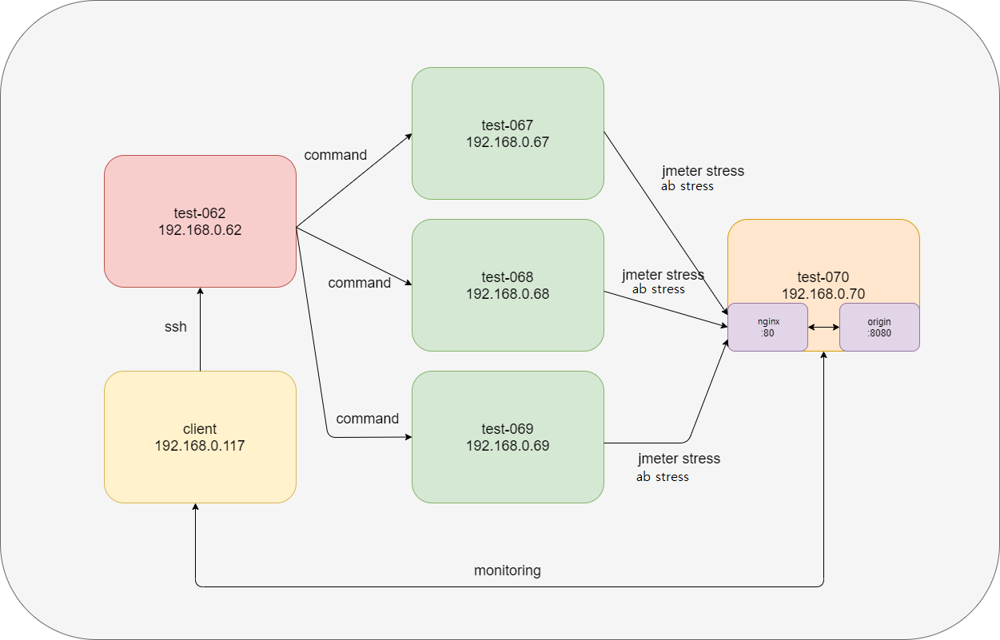

# ansible loadtest
## 소개
다수의 서버에서 한 서버에 동시에 부하를 주는 테스트를 구성합니다.

 

## 상세 소개
한대의 서버에서 부하를 주는 테스트를 진행하는 것은 실제 pruduction 환경에서의 부하와 비교하면 한계가 있기 마련입니다. 때문에 여러대의 서버를 활용해 동시에 한 서버에 부하를 주는 테스트를 구성합니다. 각각의 서버마다 일일이 접속하여 command를 날리는 것은 매우 비효율적이기에 ansible 배포 관리툴을 활용하여 자동 테스트 되도록 구성합니다.

 

## 구성도


client : windosws 클라이언트. 구성도 예시에서는 test-062에 접속하여 명령을 내리고, 부하를 받는 서버인 test-070의 nginx를 모니터링합니다.

test-062 : ansible commnad를 날리는 ansible tower(관제탑)

test-067, test-068, test-069 : jmeter command를 실행하는 probe. test-70에 부하를 주게 됩니다.

test-070 : 부하를 받는 서버. endpoint인 192.168.0.70:80에 nginx가 있고 origin server의 8080 포트에 proxypass로 접근합니다.

## 모니터링
```sh
$ ssh user@192.168.0.70
$ tail -f /var/log/nginx/access.log
```